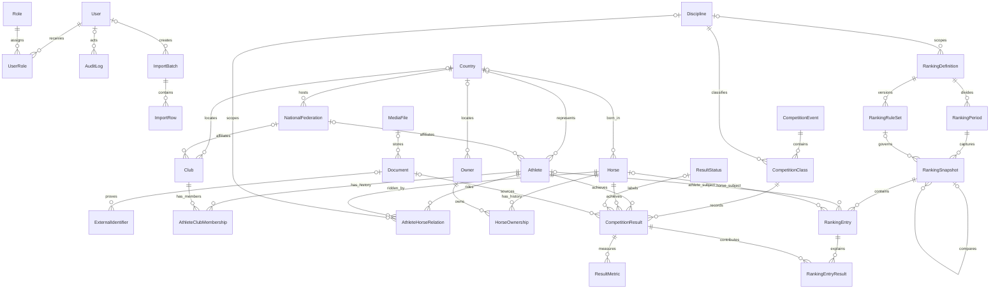

# Database v1 ER Diagram

The diagram shows storage relationships, not authorization, registration or a ranking-calculation process. Polymorphic `ExternalIdentifier`, `AuditLog` and `ImportRow` targets are intentionally not drawn as database foreign keys.

## Important boundaries

- `CompetitionResult` does not duplicate `competitionEventId`; the event is reached through its required class.
- Ranking snapshots are historical revisions. Recalculation creates a new graph.
- Athlete/horse pair ranking entries use both FKs, not a fabricated pair identifier.
- Archive does not cascade into relation history, results, identifiers or rankings.

