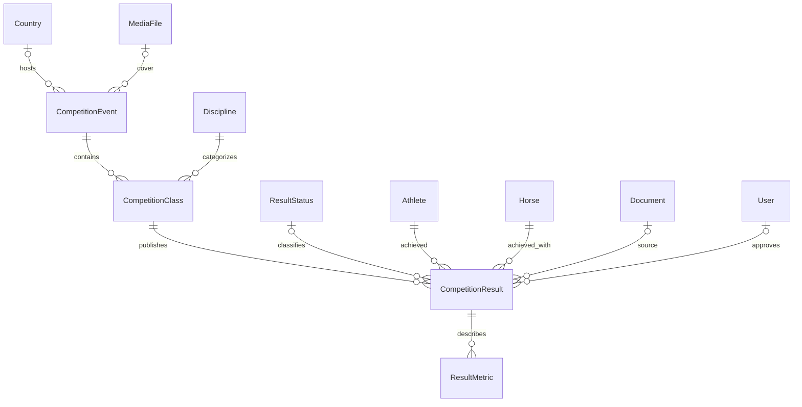

# Competition and Results Data Model Proposal

## Status and scope

- Author: Competition and Results Analyst (Agent 2)
- Status: proposal for Lead Database Architect review
- Confidence: structural decisions explicitly required by the task are confirmed; federation-specific semantics are marked `provisional`
- Scope: information publication chain `CompetitionEvent -> CompetitionClass -> CompetitionResult`, the supporting `ResultMetric` and `ResultStatus` reference

This model describes events and post-event results. It is not a participant registration or competition operations system.

## Explicit non-goals

The database proposal does **not** contain applications, registrations, entries, payments, waiting lists, start lists, draws, live scoring, participant accounts or any equivalent workflow. A `CompetitionResult` is a published-information record, not evidence that an athlete registered for an event.

## Proposed relationship model

Cardinality and invariants:

1. An event contains zero or more classes. An event may be announced before its class list is known.
2. A class belongs to exactly one event and exactly one discipline.
3. A result belongs to exactly one class, one athlete and one horse.
4. A result may have zero or one result-status reference and zero or more metrics.
5. Event-level results are intentionally not duplicated: the event is reached through the required class relation.
6. A result starts as a draft and may become public only through an explicit publication transition. Creation alone never publishes it.
7. Historical/published records are archived rather than physically deleted. Foreign keys to class, athlete and horse use restrictive deletion behavior.

## Field classification legend

- **Origin** describes who supplies the value: `system`, `editor/import`, `official source`, or a combination.
- **Nature** is `internal` for platform mechanics, `official` for a claim copied from an external/official source, or `mixed` where the value may be either.
- **Visibility** is the expected API exposure: `public`, `internal`, or `conditional` (only when the parent record is published and policy permits it).
- **Decision** is `confirmed` when required by the task or a stable technical invariant; `provisional` when Federation rules or source contracts are still unknown.

## CompetitionEvent

The event is the public information container. It does not represent registration or participation.

| Field | PostgreSQL / Prisma type | Required | Unique | Origin | Nature | Visibility | Decision | Notes |
| --- | --- | --- | --- | --- | --- | --- | --- | --- |
| `id` | `uuid / String @db.Uuid` | yes | PK | system | internal | internal | confirmed | Never reused; not an official event number. |
| `title` | `text / String` | yes | no | editor/import | mixed | public | confirmed | Human-readable title from the selected source. |
| `slug` | `text / String` | yes | yes | system/editor | internal | public | confirmed | Stable routing key; not an official identifier. Normalize to lowercase ASCII slug form. |
| `description` | `text / String?` | no | no | editor/import | mixed | public | confirmed | Nullable because the source may not provide a description. |
| `startDate` | `date / DateTime @db.Date` | yes | no | official source/editor | official | public | confirmed | Date-only unless a future approved requirement adds times/timezone. |
| `endDate` | `date / DateTime @db.Date` | yes | no | official source/editor | official | public | confirmed | Must be greater than or equal to `startDate`. |
| `location` | `text / String?` | no | no | official source/editor | mixed | public | confirmed | City/region/free-text locality; nullable while incomplete. |
| `venue` | `text / String?` | no | no | official source/editor | mixed | public | confirmed | Venue name, kept separate from locality. |
| `countryId` | `uuid / String? @db.Uuid` | no | FK | official source/editor | mixed | public | confirmed | Nullable for incomplete imported announcements; references `Country`. |
| `organizerName` | `text / String?` | no | no | official source/editor | official | public | confirmed | Free text until an organizer entity is approved. |
| `status` | enum or reference | yes | no | editor/import | mixed | conditional | provisional | Operational/event lifecycle vocabulary is not approved. Default should be a neutral internal state, not an official FEI status. |
| `publicationStatus` | internal enum/reference | yes | no | system/editor | internal | internal | confirmed | Separate from event status; default `DRAFT`. Exact extended vocabulary is provisional. |
| `coverMediaId` | `uuid / String? @db.Uuid` | no | FK | editor | internal | public | confirmed | Nullable relation to `MediaFile`; deletion should set null, not delete the event. |
| `publishedAt` | `timestamptz / DateTime?` | no | no | system | internal | public | confirmed | Set only by an explicit publish transition; null for drafts. |
| `isDemo` | `boolean / Boolean` | yes | no | system | internal | internal | confirmed | Required segregation flag; default false outside seed. |
| `archivedAt` | `timestamptz / DateTime?` | no | no | system/editor | internal | internal | confirmed | Soft deletion/archive marker. |
| `createdAt` | `timestamptz / DateTime` | yes | no | system | internal | internal | confirmed | Immutable creation timestamp. |
| `updatedAt` | `timestamptz / DateTime` | yes | no | system | internal | internal | confirmed | Automatically updated. |

Recommended indexes:

- unique normalized `slug`;
- `(publicationStatus, startDate)` for public listings;
- `(countryId, startDate)` for country/date filters;
- `(status, startDate)` for editorial views;
- `archivedAt` or a partial index on active records, implemented in migration SQL if query volume justifies it;
- `isDemo` for strict demo-data filtering where mixed databases are allowed (mixing with production remains discouraged).

## CompetitionClass

A class is the smallest required competition context for a result. `category` and `level` deliberately remain flexible and nullable until authoritative reference data is provided.

| Field | PostgreSQL / Prisma type | Required | Unique | Origin | Nature | Visibility | Decision | Notes |
| --- | --- | --- | --- | --- | --- | --- | --- | --- |
| `id` | `uuid / String @db.Uuid` | yes | PK | system | internal | internal | confirmed | Internal identifier only. |
| `competitionEventId` | `uuid / String @db.Uuid` | yes | FK | system/editor | internal | conditional | confirmed | Required parent event. |
| `title` | `text / String` | yes | no | official source/editor | mixed | public | confirmed | Source title; should not be derived from unknown rules. |
| `disciplineId` | `uuid / String @db.Uuid` | yes | FK | official source/editor | mixed | public | confirmed | Required normalized discipline reference. |
| `category` | `text / String?` | no | no | official source/editor | official | public | provisional | No fixed vocabulary until approved. Preserve source spelling. |
| `level` | `text / String?` | no | no | official source/editor | official | public | provisional | No fixed hierarchy or validation until approved. |
| `competitionDate` | `date / DateTime? @db.Date` | no | no | official source/editor | official | public | confirmed | Nullable if class schedule is not known; if present, should fall within event dates (service/import validation). |
| `sortOrder` | `integer / Int` | yes | no | editor/import | internal | public | confirmed | Non-negative display order within the event; default 0. |
| `status` | enum or reference | yes | no | editor/import | mixed | conditional | provisional | Class lifecycle vocabulary is not approved. Do not reuse sports result-status codes. |
| `createdAt` | `timestamptz / DateTime` | yes | no | system | internal | internal | confirmed | Immutable creation timestamp. |
| `updatedAt` | `timestamptz / DateTime` | yes | no | system | internal | internal | confirmed | Automatically updated. |

Recommended indexes:

- `(competitionEventId, sortOrder)` for event pages;
- `(disciplineId, competitionDate)` for discipline/date filters;
- `(competitionEventId, status)` for administration;
- no uniqueness on `(competitionEventId, title)` because repeated titles/rounds are possible and the Federation naming rules are unknown.

`CompetitionClass` does not duplicate `isDemo`: demo provenance is inherited from its required event. The service and seed must prevent a class from crossing demo/non-demo boundaries through its relations. If the Lead Architect chooses row-level database policies based on `isDemo`, denormalizing this flag may be reconsidered and documented.

## ResultStatus

This is a data-managed sports result-status dictionary, not the platform publication workflow. No code values are asserted in this proposal; examples such as DNS, DNF, RET, EL and disqualification must be loaded only from an approved source or clearly marked demo/provisional.

| Field | PostgreSQL / Prisma type | Required | Unique | Origin | Nature | Visibility | Decision | Notes |
| --- | --- | --- | --- | --- | --- | --- | --- | --- |
| `id` | `uuid / String @db.Uuid` | yes | PK | system | internal | internal | confirmed | Internal identifier. |
| `code` | `text / String` | yes | normalized unique | official source/editor | official | public | confirmed structure, provisional values | Store normalized uppercase code; never infer semantics from the code in application logic. |
| `label` | `text / String` | yes | no | official source/editor | official | public | confirmed structure, provisional values | Display text; localization strategy remains open. |
| `description` | `text / String?` | no | no | official source/editor | official | public | provisional | Optional source-backed explanation. |
| `isRanked` | `boolean / Boolean?` | no | no | official source/editor | official | conditional | provisional | Nullable because ranking eligibility is an unknown rule; must not drive calculation before approval. |
| `sortOrder` | `integer / Int` | yes | no | editor | internal | public | confirmed | Presentation only. |
| `isActive` | `boolean / Boolean` | yes | no | editor | internal | internal | confirmed | Deactivate instead of deleting a referenced code. |
| `isDemo` | `boolean / Boolean` | yes | no | system | internal | internal | confirmed | Separates seed vocabularies from approved dictionaries. |
| `createdAt` | `timestamptz / DateTime` | yes | no | system | internal | internal | confirmed | Creation timestamp. |
| `updatedAt` | `timestamptz / DateTime` | yes | no | system | internal | internal | confirmed | Update timestamp. |

Recommended indexes and constraints:

- unique normalized `code`; if official vocabularies can differ by governing body/discipline, replace global uniqueness with scoped uniqueness after that scope is approved;
- `(isActive, sortOrder)` for selection lists;
- referenced statuses use restrictive deletion; retired terms are deactivated.

## CompetitionResult

A result represents an athlete-horse performance in one class. All outcome fields are nullable because a valid published result may be expressed as a place, a numeric value, a text value, or only a source-backed status.

| Field | PostgreSQL / Prisma type | Required | Unique | Origin | Nature | Visibility | Decision | Notes |
| --- | --- | --- | --- | --- | --- | --- | --- | --- |
| `id` | `uuid / String @db.Uuid` | yes | PK | system | internal | internal | confirmed | Internal identifier only. |
| `competitionClassId` | `uuid / String @db.Uuid` | yes | FK | official source/editor | mixed | public | confirmed | Result cannot exist without a class. |
| `athleteId` | `uuid / String @db.Uuid` | yes | FK | official source/editor | mixed | public | confirmed | Required athlete. |
| `horseId` | `uuid / String @db.Uuid` | yes | FK | official source/editor | mixed | public | confirmed | Required horse. |
| `rank` | `integer / Int?` | no | no | official source/import | official | public | confirmed | Positive if present; absent for unranked/status-only results. |
| `statusId` | `uuid / String? @db.Uuid` | no | FK | official source/import | official | public | confirmed structure, provisional values | Nullable reference to `ResultStatus`; no hard-coded code semantics. |
| `resultDisplay` | `text / String?` | no | no | official source/import | official | public | confirmed | Source-faithful human-readable outcome. |
| `penalties` | `decimal / Decimal?` | no | no | official source/import | official | public | provisional | Meaning, scale and applicability depend on discipline/class rules. |
| `timeSeconds` | `decimal / Decimal?` | no | no | official source/import | official | public | provisional | Numeric seconds for sorting/display where the source supports it. |
| `points` | `decimal / Decimal?` | no | no | official source/import | official | public | provisional | Competition result points; not ranking points unless an approved rule explicitly maps them. |
| `bonus` | `decimal / Decimal?` | no | no | official source/import | official | public | provisional | Retained only because required by scope; no calculation semantics are asserted. |
| `sourceDocumentId` | `uuid / String? @db.Uuid` | no | FK | editor/import | internal | conditional | confirmed | Optional immutable/source document relation. |
| `sourceReference` | `text / String?` | no | no | editor/import | mixed | conditional | confirmed | URL, page/cell reference or external citation; sanitize before public exposure. |
| `publicationStatus` | internal enum/reference | yes | no | system/editor | internal | internal | confirmed | Defaults to `DRAFT`; independent of sports status. |
| `approvedAt` | `timestamptz / DateTime?` | no | no | system/editor | internal | internal | confirmed | Evidence of editorial approval, not Federation sporting certification unless policy says so. |
| `approvedById` | `uuid / String? @db.Uuid` | no | FK | system | internal | internal | confirmed | Nullable relation to `User`; retain event even if the user is later deactivated. |
| `publishedAt` | `timestamptz / DateTime?` | no | no | system | internal | public | confirmed | Recommended addition for traceable explicit publication. |
| `isDemo` | `boolean / Boolean` | yes | no | system | internal | internal | confirmed | Required separation for seeded results. |
| `archivedAt` | `timestamptz / DateTime?` | no | no | system/editor | internal | internal | confirmed | Soft deletion/archive marker. |
| `createdAt` | `timestamptz / DateTime` | yes | no | system | internal | internal | confirmed | Creation timestamp. |
| `updatedAt` | `timestamptz / DateTime` | yes | no | system | internal | internal | confirmed | Update timestamp. |

Recommended indexes:

- `(competitionClassId, publicationStatus, rank)` for class result tables;
- `(athleteId, publicationStatus, createdAt)` for athlete history;
- `(horseId, publicationStatus, createdAt)` for horse history;
- `(statusId, publicationStatus)` for status filters;
- `(archivedAt, publicationStatus)` or a partial active/public index after real query-plan review;
- `(sourceDocumentId)` for provenance lookups;
- no unconditional unique constraint on `(competitionClassId, athleteId, horseId)` until rules for rounds, duplicate corrections and imports are approved. Duplicate candidates must be flagged by import/service logic meanwhile.

Database-level checks recommended in the initial migration:

- `rank IS NULL OR rank > 0`;
- numeric scales use non-lossy, bounded decimals; exact precision is provisional and must be reviewed against source files;
- `approvedAt` and `approvedById` are both null or both non-null, unless an approved system-approval mode is added;
- `publishedAt IS NOT NULL` when the internal publication status is published, and null publication cannot happen on insert by default;
- no hard delete of referenced athletes, horses, classes, result statuses or source documents.

The requirement that a result contain at least one outcome (`rank`, `statusId`, display/numeric field or a metric) crosses the parent/child boundary. Enforce it in a transactional application service and add an integration test; do not use a fragile cross-table PostgreSQL check constraint.

## ResultMetric

`ResultMetric` normalizes additional source-backed measurements. It is preferred over unstructured JSON whenever a metric can be assigned a stable source code. JSON is only a reserve layer for raw imports, not the public result contract.

| Field | PostgreSQL / Prisma type | Required | Unique | Origin | Nature | Visibility | Decision | Notes |
| --- | --- | --- | --- | --- | --- | --- | --- | --- |
| `id` | `uuid / String @db.Uuid` | yes | PK | system | internal | internal | confirmed | Internal identifier. |
| `competitionResultId` | `uuid / String @db.Uuid` | yes | FK | system/import | internal | conditional | confirmed | Required result parent. |
| `metricCode` | `text / String` | yes | scoped | official source/import | mixed | public | confirmed structure, provisional values | Normalized code; codes require source documentation and must not imply an unapproved formula. |
| `numericValue` | `decimal / Decimal?` | no | no | official source/import | official | public | confirmed | Machine-readable numeric value. |
| `textValue` | `text / String?` | no | no | official source/import | official | public | confirmed | Source text when the metric is not safely numeric. |
| `unit` | `text / String?` | no | no | official source/import | official | public | provisional | Preserve source unit; a canonical unit dictionary is not yet approved. |
| `sortOrder` | `integer / Int` | yes | no | editor/import | internal | public | confirmed | Non-negative ordering within the result. |
| `createdAt` | `timestamptz / DateTime` | yes | no | system | internal | internal | confirmed | Creation timestamp. |
| `updatedAt` | `timestamptz / DateTime` | yes | no | system | internal | internal | confirmed | Update timestamp. |

Recommended constraints and indexes:

- check that exactly one of `numericValue` and `textValue` is non-null;
- check `sortOrder >= 0`;
- index `(competitionResultId, sortOrder)`;
- unique `(competitionResultId, metricCode, sortOrder)` permits repeated source metric codes while preventing exact duplicate positions;
- deleting metrics through cascade is acceptable only as part of an explicitly authorized hard delete of a never-published/demo result; the normal lifecycle archives the parent instead.

## Publication and correction workflow

The workflow is an internal platform concern and must not be confused with sporting result statuses.

1. Create event/result in `DRAFT` regardless of imported source claims.
2. Validate required relations and source provenance.
3. Record approval metadata when an authorized user approves it.
4. Execute a separate publish command that sets publication state and timestamp atomically and writes `AuditLog`.
5. Corrections to published values write an audit record with old/new data and source/reason. The record is not replaced by a new UUID merely to hide history.
6. Withdrawal/unpublication vocabulary and whether approval is mandatory before publication remain provisional and belong in `OPEN_QUESTIONS.md`.

Public API queries must filter by the approved public publication state, exclude `archivedAt IS NOT NULL`, and avoid returning source/internal approval details unless explicitly authorized.

## Import and provenance behavior

- Each imported event/class/result is linked indirectly to `ImportBatch`/`ImportRow` through the generic import linkage defined by the governance design; raw input remains in `ImportRow.rawData`.
- `sourceDocumentId`/`sourceReference` identify the human-reviewable origin of a result.
- Re-import must not silently overwrite a published result. It creates a reviewable candidate/update with audit context.
- Match candidates by official external identifiers where verified. Names, dates and the athlete-horse pair are similarity signals, never authoritative identifiers.
- Conflicting rank/status/metric values are retained in import evidence and resolved by an authorized review step.

## Deletion and referential actions

- Event, class and result domain records use `RESTRICT`/`NO ACTION` for parent references by default. They are archived instead of cascaded.
- A class with results cannot be physically deleted.
- An event with classes cannot be physically deleted.
- A status already referenced by a result is deactivated rather than deleted.
- `coverMediaId` and `approvedById` may use `SET NULL` only if audit/provenance remains sufficient; `sourceDocumentId` should be restricted for published records.
- Official and published result data is never physically removed by a normal API operation.

## Conflicts and decisions for Lead Architect

1. **Event-level result link:** rejected. A mandatory class relation satisfies the required chain and avoids ambiguous duplicate ownership.
2. **Fixed sports status enum:** rejected. Use `ResultStatus` records; values and semantics are provisional until sourced.
3. **Fixed category/level dictionaries:** rejected for v1. Nullable text preserves source data without inventing official catalogs.
4. **JSON metrics:** rejected as the primary design. Use relational `ResultMetric`; raw import JSON remains an evidence layer only.
5. **Pair uniqueness per class:** deferred. It may reject legitimate multi-round/source revisions; implement duplicate review until the cardinality rule is approved.
6. **Event/class lifecycle vocabulary:** deferred. Do not equate operational status, publication status and sports result status.
7. **Published-result approval requirement:** deferred. Explicit publication is mandatory, but the authorized role and mandatory approval sequence require governance confirmation.

## Open questions to merge into `docs/OPEN_QUESTIONS.md`

- What are the authoritative event and class lifecycle states, and which source owns them?
- What is the exact publication workflow, and must every result be approved by a second user before publication?
- What is the official result-status dictionary, including localization and discipline-specific scope?
- Can the same athlete-horse pair have multiple result rows in one class (rounds, phases, corrections or team/individual contexts)?
- Are `category` and `level` global, discipline-specific or season-specific reference dictionaries?
- What precision, scale, sign and units apply to penalties, time, points and bonus per discipline?
- Should class dates include time and timezone, or are calendar dates sufficient?
- Which result/source fields are publicly visible, and what is the retention period for source documents?
- How are team results, ties, ex-aequo ranks and multi-athlete/multi-horse formats represented if they enter scope?
- Who is the authoritative organizer entity, and is free-text `organizerName` sufficient for v1?

