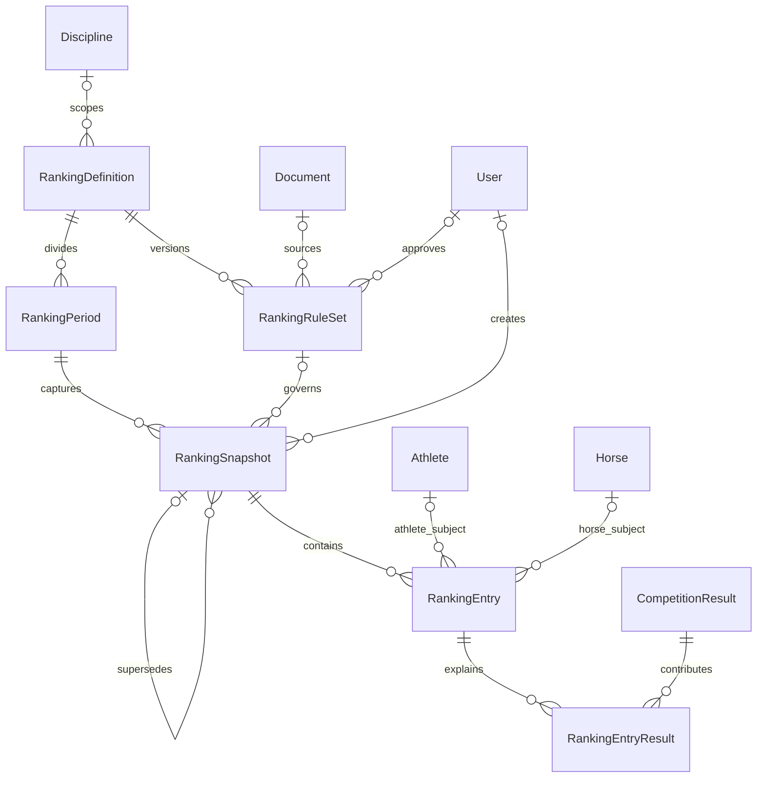

# Proposal 04: Ranking Storage and Extensibility

- Автор: Ranking and Extensibility Architect (Agent 4)
- Статус: proposal for Lead Database Architect review
- Дата: 2026-07-22
- Область: хранение определений, версий правил, периодов, исторических snapshots, позиций и связей с исходными результатами

## 1. Границы предложения

Эта модель создаёт только устойчивую структуру хранения рейтингов. Она не определяет и не реализует официальную формулу Национальной федерации конного спорта Молдовы.

В предложении намеренно отсутствуют:

- коэффициенты, таблицы очков, правила eligibility и tie-breaking;
- автоматическое толкование `CompetitionResult.points`, `rank`, `statusId` или `ResultMetric` как рейтинговых очков;
- утверждение, что demo-расчёт является официальным;
- изменение исторического snapshot при перерасчёте;
- зависимость от frontend или конкретного представления рейтинга.

Поддерживаются три технических типа субъекта:

- спортсмен (`ATHLETE`);
- лошадь (`HORSE`);
- пара спортсмен–лошадь (`ATHLETE_HORSE_PAIR`).

Названия кодов являются внутренними техническими значениями, а не официальной терминологией Федерации. Расширение типов требует review схемы, API и миграции.

## 2. Предлагаемая модель связей



Основная цепочка:

```text
RankingDefinition
├── RankingRuleSet (version 1..N)
└── RankingPeriod
    └── RankingSnapshot (revision 1..N)
        └── RankingEntry
            └── RankingEntryResult -> CompetitionResult
```

`RankingSnapshot` является исторической границей. Перерасчёт создаёт новую revision и новые entries; старые строки не переписываются.

## 3. Легенда полей

- **Required** — технически необходимый инвариант v1.
- **Unique** — предлагаемое ограничение БД.
- **Nature** — `internal` для механики платформы, `official` только для значения из подтверждённого источника, `mixed` если значение может быть импортировано или задано редакцией.
- **Visibility** — максимальная предполагаемая видимость; фактическая выдача зависит от publication policy.
- **Decision** — `confirmed` заданием или техническим инвариантом; `provisional` требует официального решения или эксплуатационного подтверждения.

## 4. RankingDefinition

Определяет устойчивую категорию рейтинга: его название, дисциплину и тип субъекта. Не содержит формулу.

| Field | PostgreSQL / Prisma | Required | Unique | Source | Nature | Visibility | Decision | Notes |
| --- | --- | --- | --- | --- | --- | --- | --- | --- |
| `id` | `uuid / String @db.Uuid` | yes | PK | system | internal | internal | confirmed | Неофициальный UUID, никогда не переиспользуется. |
| `code` | `text / String` | yes | global normalized unique | administrator | internal | public | confirmed structure, provisional values | Стабильный технический ключ; не официальный код FEI. |
| `name` | `text / String` | yes | no | administrator/source | mixed | public | confirmed | Отображаемое название. |
| `description` | `text / String?` | no | no | administrator/source | mixed | public | provisional | Не должно описывать неподтверждённую формулу как официальную. |
| `disciplineId` | `uuid / String? @db.Uuid` | no | FK | administrator/source | mixed | public | provisional | Nullable, чтобы не объявлять все рейтинги дисциплинарными до подтверждения. |
| `subjectType` | technical enum/code | yes | no | administrator | internal | public | confirmed structure | `ATHLETE`, `HORSE` или `ATHLETE_HORSE_PAIR`; не спортивный официальный словарь. |
| `status` | technical enum/code | yes | no | system/administrator | internal | internal | confirmed field, provisional vocabulary | Lifecycle definition; не publication status snapshot. |
| `isDemo` | `boolean / Boolean` | yes | no | system | internal | internal | confirmed | Demo definitions не смешиваются с production dataset. |
| `archivedAt` | `timestamptz / DateTime?` | no | no | system/administrator | internal | internal | confirmed | Soft delete. |
| `createdAt` | `timestamptz / DateTime` | yes | no | system | internal | internal | confirmed | Timestamp создания. |
| `updatedAt` | `timestamptz / DateTime` | yes | no | system | internal | internal | confirmed | Timestamp изменения. |

Рекомендуемые индексы:

- unique `code` после централизованной нормализации;
- `(disciplineId, subjectType, status, archivedAt)` для каталога определений;
- `(isDemo, archivedAt)` для контроля demo boundary.

## 5. RankingRuleSet

Версионируемая конфигурация, которая описывает provenance и будущие параметры расчёта. Наличие строки не означает, что правила официальны или что платформа умеет выполнить расчёт.

| Field | PostgreSQL / Prisma | Required | Unique | Source | Nature | Visibility | Decision | Notes |
| --- | --- | --- | --- | --- | --- | --- | --- | --- |
| `id` | `uuid / String @db.Uuid` | yes | PK | system | internal | internal | confirmed | Внутренний UUID. |
| `rankingDefinitionId` | `uuid / String @db.Uuid` | yes | FK | system | internal | internal | confirmed | Версия принадлежит одному definition. |
| `version` | `integer / Int` | yes | scoped | system/administrator | internal | internal | confirmed | Положительный монотонный номер внутри definition. |
| `name` | `text / String` | yes | no | administrator/source | mixed | internal | confirmed | Понятное название версии. |
| `calculationMethod` | `text / String?` | no | no | administrator/source | mixed | internal | provisional | Метод не придумывается. Для demo допускается только явно заданное `DEMO`. |
| `configuration` | `jsonb / Json?` | no | no | approved configuration | mixed | internal | confirmed container, provisional content | Версионированные параметры; null или пустой объект не заменяется вымышленной формулой. |
| `configurationSchemaVersion` | `text / String?` | no | no | system | internal | internal | confirmed concept | Версия Zod/JSON contract, если configuration присутствует. |
| `engineVersion` | `text / String?` | no | no | build/deployment | internal | internal | provisional | Версия будущего детерминированного калькулятора; v1 calculator отсутствует. |
| `status` | technical enum/code | yes | no | system/administrator | internal | internal | confirmed field, provisional vocabulary | Draft/approved/retired semantics требуют governance. |
| `effectiveFrom` | `date / DateTime? @db.Date` | no | no | official source/administrator | official | internal | provisional | Не заполнять без подтверждённой области действия. |
| `effectiveTo` | `date / DateTime? @db.Date` | no | no | official source/administrator | official | internal | provisional | Если задано, не раньше `effectiveFrom`. |
| `sourceDocumentId` | `uuid / String? @db.Uuid` | no | FK | source workflow | internal | internal | confirmed | Документ-основание, если его разрешено хранить. |
| `sourceReference` | `text / String?` | no | no | source workflow | mixed | internal | confirmed | Нечувствительная ссылка/цитата на источник. |
| `approvedAt` | `timestamptz / DateTime?` | no | no | governance | internal | internal | provisional workflow | Не равнозначно официальному утверждению Федерацией без policy. |
| `approvedById` | `uuid / String? @db.Uuid` | no | FK | system | internal | internal | provisional workflow | Должно быть парным с `approvedAt`. |
| `isDemo` | `boolean / Boolean` | yes | no | system | internal | internal | confirmed | Должен совпадать с definition/snapshot graph. |
| `archivedAt` | `timestamptz / DateTime?` | no | no | system/administrator | internal | internal | confirmed | Используется вместо hard delete. |
| `createdAt` | `timestamptz / DateTime` | yes | no | system | internal | internal | confirmed | Timestamp создания. |
| `updatedAt` | `timestamptz / DateTime` | yes | no | system | internal | internal | confirmed | Timestamp изменения draft-версии. |

Ограничения:

- unique `(rankingDefinitionId, version)`;
- `version > 0`;
- `effectiveTo IS NULL OR effectiveFrom IS NULL OR effectiveTo >= effectiveFrom`;
- `approvedAt` и `approvedById` либо оба null, либо оба заполнены, пока не утверждён system-approval mode;
- `configuration` валидируется централизованной versioned Zod schema;
- rule set, на который ссылается любой snapshot, становится immutable; исправление создаёт новую version;
- JSON запрещено использовать для исполняемого JavaScript/SQL, секретов, персональных данных, копии всех результатов или неструктурированного замещения relational tables.

Рекомендуемые индексы:

- unique `(rankingDefinitionId, version)`;
- `(rankingDefinitionId, status, archivedAt)`;
- `(sourceDocumentId)` и `(approvedById)` для provenance.

## 6. RankingPeriod

Период группирует snapshots одной ranking definition. Календарные границы nullable, потому что официальная модель периодов, rolling windows и season cutoffs пока неизвестна.

| Field | PostgreSQL / Prisma | Required | Unique | Source | Nature | Visibility | Decision | Notes |
| --- | --- | --- | --- | --- | --- | --- | --- | --- |
| `id` | `uuid / String @db.Uuid` | yes | PK | system | internal | internal | confirmed | Внутренний UUID. |
| `rankingDefinitionId` | `uuid / String @db.Uuid` | yes | FK | system | internal | internal | confirmed | Период принадлежит одному definition. |
| `code` | `text / String` | yes | scoped | administrator/source | internal | public | confirmed structure, provisional values | Технический ключ периода внутри definition. |
| `label` | `text / String` | yes | no | administrator/source | mixed | public | confirmed | Отображаемое название периода. |
| `startDate` | `date / DateTime? @db.Date` | no | no | official source/administrator | official | public | provisional | Nullable для snapshot-only/неполного источника. |
| `endDate` | `date / DateTime? @db.Date` | no | no | official source/administrator | official | public | provisional | Если задано, не раньше `startDate`. |
| `status` | technical enum/code | yes | no | system/administrator | internal | internal | confirmed field, provisional vocabulary | Не определяет официальную eligibility. |
| `isDemo` | `boolean / Boolean` | yes | no | system | internal | internal | confirmed | Совпадает с definition graph. |
| `archivedAt` | `timestamptz / DateTime?` | no | no | system/administrator | internal | internal | confirmed | Soft delete. |
| `createdAt` | `timestamptz / DateTime` | yes | no | system | internal | internal | confirmed | Timestamp создания. |
| `updatedAt` | `timestamptz / DateTime` | yes | no | system | internal | internal | confirmed | Timestamp изменения. |

Ограничения и индексы:

- unique `(rankingDefinitionId, code)`;
- `endDate IS NULL OR startDate IS NULL OR endDate >= startDate`;
- `(rankingDefinitionId, startDate, endDate)` для period lookup;
- `(status, archivedAt)` для внутренних очередей.

Период не должен автоматически выбирать результаты по датам: inclusion/exclusion является неизвестным правилом рейтинга.

## 7. RankingSnapshot

Snapshot — неизменяемое историческое состояние одного периода в определённый момент. Revision отделяет повторный расчёт от истории предыдущей публикации.

| Field | PostgreSQL / Prisma | Required | Unique | Source | Nature | Visibility | Decision | Notes |
| --- | --- | --- | --- | --- | --- | --- | --- | --- | --- |
| `id` | `uuid / String @db.Uuid` | yes | PK | system | internal | internal | confirmed | Внутренний UUID. |
| `rankingPeriodId` | `uuid / String @db.Uuid` | yes | FK | system | internal | public | confirmed | Период snapshot. Definition выводится через period. |
| `rankingRuleSetId` | `uuid / String? @db.Uuid` | no | FK | system/administrator | internal | internal | provisional nullability | Требуется для future calculated snapshot; nullable для исходного/imported draft с неизвестными правилами. |
| `revision` | `integer / Int` | yes | scoped | system | internal | public | confirmed | Положительный номер revision внутри period. |
| `snapshotAt` | `timestamptz / DateTime` | yes | no | system/source | mixed | public | confirmed | Момент, который представляет snapshot; не равен автоматически `createdAt`. |
| `calculationMethod` | `text / String?` | no | no | system/source | mixed | internal | provisional | Для demo seed строго `DEMO`; отсутствие метода не заполняется догадкой. |
| `calculationStatus` | technical enum/code | yes | no | system | internal | internal | confirmed field, provisional vocabulary | Статус подготовки/расчёта, независимый от публикации. |
| `publicationStatus` | technical enum/code | yes | no | system/editor | internal | internal | confirmed | Default `DRAFT`; public state достигается отдельной audited transition. |
| `calculatedAt` | `timestamptz / DateTime?` | no | no | system | internal | internal | confirmed | Заполняется только после успешной фиксации entries. |
| `publishedAt` | `timestamptz / DateTime?` | no | no | system | internal | public | confirmed | Null для draft; выставляется отдельной публикацией. |
| `createdById` | `uuid / String? @db.Uuid` | no | FK | system | internal | internal | confirmed | Nullable для controlled seed/import. |
| `supersedesSnapshotId` | `uuid / String? @db.Uuid` | no | self FK | system | internal | internal | confirmed | Прямой predecessor при перерасчёте того же периода. |
| `comparisonSnapshotId` | `uuid / String? @db.Uuid` | no | self FK | administrator/rules | internal | internal | provisional | Явная база для `previousRank`; не выбирается молча по дате. |
| `notes` | `text / String?` | no | no | administrator/source | mixed | internal | provisional | Без секретов и персональных данных. |
| `isDemo` | `boolean / Boolean` | yes | no | system | internal | internal | confirmed | Demo snapshot не публикуется как официальный. |
| `archivedAt` | `timestamptz / DateTime?` | no | no | system/administrator | internal | internal | confirmed | Withdraw/archive без уничтожения history. |
| `createdAt` | `timestamptz / DateTime` | yes | no | system | internal | internal | confirmed | Timestamp создания. |
| `updatedAt` | `timestamptz / DateTime` | yes | no | system | internal | internal | confirmed | Меняется только до freeze и при audited lifecycle transition. |

Ограничения:

- unique `(rankingPeriodId, revision)`;
- `revision > 0`;
- self-links не могут ссылаться на сам snapshot;
- `supersedesSnapshotId` должен относиться к тому же period; проверяется транзакционным сервисом;
- rule set должен принадлежать тому же definition, что и period; проверяется транзакционным сервисом или составными FK, если Lead Architect выберет денормализацию `rankingDefinitionId`;
- `comparisonSnapshotId` должен иметь тот же `RankingDefinition` и совместимый `subjectType`; period может отличаться;
- published snapshot обязан иметь `publishedAt`; draft demo seed обязан иметь `publicationStatus=DRAFT` и `publishedAt=null`;
- успешно завершённый snapshot обязан иметь `calculatedAt`; точная status vocabulary остаётся provisional;
- завершённые/published snapshots и их children immutable; перерасчёт создаёт новую revision.

Рекомендуемые индексы:

- unique `(rankingPeriodId, revision)`;
- `(rankingPeriodId, publicationStatus, snapshotAt)` для history;
- `(calculationStatus, createdAt)` для будущей job queue/monitoring;
- `(supersedesSnapshotId)` и `(comparisonSnapshotId)`;
- `(isDemo, publicationStatus, archivedAt)` для boundary/public filters.

Не предлагается `isCurrent`: текущий публичный snapshot выбирается детерминированным запросом среди опубликованных non-archived revisions либо будущей отдельно утверждённой promotion-моделью. Это исключает две конкурирующие `isCurrent=true` записи.

## 8. RankingEntry

Entry хранит позицию одного субъекта внутри snapshot. Для database-level referential integrity используются явные nullable FK, а не полиморфный `entityType + entityId`.

| Field | PostgreSQL / Prisma | Required | Unique | Source | Nature | Visibility | Decision | Notes |
| --- | --- | --- | --- | --- | --- | --- | --- | --- | --- |
| `id` | `uuid / String @db.Uuid` | yes | PK | system | internal | internal | confirmed | Внутренний UUID. |
| `rankingSnapshotId` | `uuid / String @db.Uuid` | yes | FK | system | internal | public | confirmed | Parent snapshot. |
| `subjectType` | technical enum/code | yes | scoped shape | system | internal | public | confirmed | Должен совпадать с definition subject type. |
| `athleteId` | `uuid / String? @db.Uuid` | conditional | partial unique | source/results | mixed | public | confirmed | Required для athlete и pair. |
| `horseId` | `uuid / String? @db.Uuid` | conditional | partial unique | source/results | mixed | public | confirmed | Required для horse и pair. |
| `rank` | `integer / Int?` | no | no | calculation/import | mixed | public | confirmed field, provisional nullability | Положительный, если задан; null разрешает неполный draft/import. |
| `previousRank` | `integer / Int?` | no | no | comparison snapshot | internal derived/imported | public | provisional semantics | Использовать только с явным `comparisonSnapshotId`. |
| `points` | `numeric / Decimal?` | no | no | calculation/import | mixed | public | confirmed field, provisional precision/meaning | Рейтинговые очки snapshot, не `CompetitionResult.points`. |
| `countedResultCount` | `integer / Int` | yes | no | system/import | internal | public | confirmed | Non-negative denormalized immutable summary. |
| `droppedResultCount` | `integer / Int` | yes | no | system/import | internal | public | confirmed | Non-negative denormalized immutable summary. |
| `createdAt` | `timestamptz / DateTime` | yes | no | system | internal | internal | confirmed | Timestamp создания. |
| `updatedAt` | `timestamptz / DateTime` | yes | no | system | internal | internal | confirmed | До freeze snapshot. |

Subject shape, обеспечиваемая миграционным SQL `CHECK`:

| `subjectType` | `athleteId` | `horseId` |
| --- | --- | --- |
| `ATHLETE` | required | null |
| `HORSE` | null | required |
| `ATHLETE_HORSE_PAIR` | required | required |

Ограничения:

- `rank IS NULL OR rank > 0`;
- `previousRank IS NULL OR previousRank > 0`;
- `countedResultCount >= 0` и `droppedResultCount >= 0`;
- уникальный субъект в одном snapshot обеспечивается тремя partial unique indexes:
  - `(rankingSnapshotId, athleteId) WHERE subjectType = 'ATHLETE'`;
  - `(rankingSnapshotId, horseId) WHERE subjectType = 'HORSE'`;
  - `(rankingSnapshotId, athleteId, horseId) WHERE subjectType = 'ATHLETE_HORSE_PAIR'`;
- `rank` намеренно не unique: правила ties/ex-aequo неизвестны;
- subjectType entry должен совпадать с definition; demo flags snapshot и subject должны быть совместимы — транзакционные service/seed checks;
- `previousRank` без `comparisonSnapshotId` запрещается service validation; значение должно соответствовать тому же субъекту в comparison snapshot либо оставаться null;
- сохранённые counts сверяются с `RankingEntryResult.isCounted` перед freeze/publication.

Prisma не описывает partial indexes и сложный subject-shape `CHECK`, поэтому они должны быть явно добавлены в reviewed migration SQL и покрыты integration tests.

Рекомендуемые обычные индексы:

- `(rankingSnapshotId, rank, id)` для стабильного списка;
- `(athleteId, rankingSnapshotId)` для истории спортсмена;
- `(horseId, rankingSnapshotId)` для истории лошади;
- `(subjectType, rank)` только после подтверждения query plans; первый индекс уже покрывает основной список.

Отдельная `AthleteHorsePair` не требуется в v1: пара идентифицируется двумя FK внутри snapshot. `AthleteHorseRelation` не является обязательным prerequisite, потому что ranking evidence должен исходить из фактических результатов, а историческая relation может отсутствовать в импортированных данных.

## 9. RankingEntryResult

Связывает entry с конкретным `CompetitionResult`, показывает, был ли источник засчитан или dropped, и сохраняет объяснимость snapshot.

| Field | PostgreSQL / Prisma | Required | Unique | Source | Nature | Visibility | Decision | Notes |
| --- | --- | --- | --- | --- | --- | --- | --- | --- | --- |
| `id` | `uuid / String @db.Uuid` | yes | PK | system | internal | internal | confirmed | Внутренний UUID. |
| `rankingEntryId` | `uuid / String @db.Uuid` | yes | scoped unique | system/import | internal | internal | confirmed | Parent entry. |
| `competitionResultId` | `uuid / String @db.Uuid` | yes | scoped unique | source/calculation | official evidence link | internal/conditional | confirmed | Источник остаётся отдельным domain fact. |
| `isCounted` | `boolean / Boolean` | yes | no | rules/import | mixed | public | confirmed | `false` обозначает dropped/not-counted source, но не объясняет причину. |
| `pointsContribution` | `numeric / Decimal?` | no | no | calculation/import | mixed | public | provisional | Вклад в `RankingEntry.points`; null, если неизвестен/не применим. |
| `decisionReason` | `text / String?` | no | no | approved rules/reviewer | mixed | internal/conditional | provisional | Человеко-читаемое объяснение без вымышленной rule semantics. |
| `sortOrder` | `integer / Int` | yes | no | system/import | internal | public | confirmed | Non-negative deterministic presentation/source order. |
| `createdAt` | `timestamptz / DateTime` | yes | no | system | internal | internal | confirmed | Timestamp создания. |

Ограничения и индексы:

- unique `(rankingEntryId, competitionResultId)` — один исходный результат не учитывается дважды в одной entry;
- `sortOrder >= 0`;
- `(rankingEntryId, isCounted, sortOrder)` для counted/dropped breakdown;
- `(competitionResultId)` для impact/provenance lookup;
- restrictive FK deletion: результат, использованный историческим snapshot, не удаляется каскадно;
- linked result должен соответствовать subject entry: athlete, horse или оба; проверяется транзакционно;
- принадлежность результата дисциплине, периоду и eligibility **не выводится автоматически** — это будущие утверждённые правила;
- сумма `pointsContribution` не обязана автоматически равняться `RankingEntry.points`, пока источник/формула не определяют такую семантику.

`RankingEntryResult` хранит только ссылки на нормализованные `CompetitionResult`. Неизвестные raw rows сначала проходят import/result workflow; JSON-копии результатов в ranking tables не создаются.

## 10. Snapshot, publication и recalculation workflow

1. Создать/выбрать `RankingDefinition` и `RankingPeriod`.
2. Сохранить отдельную `RankingRuleSet` version только из утверждённого источника; при отсутствии правил не заполнять формулу догадками.
3. Создать snapshot с новой `revision`, `calculationStatus` внутреннего draft/pending состояния и `publicationStatus=DRAFT`.
4. Записать entries и links на исходные результаты в одной контролируемой операции или staging transaction.
5. Проверить subject shape, duplicate subjects, counts, demo boundary и referential consistency.
6. После успешной подготовки зафиксировать `calculatedAt` и freeze snapshot. V1 не выполняет официальный расчёт автоматически.
7. Публиковать отдельной авторизованной командой, которая атомарно меняет publication state, устанавливает `publishedAt` и пишет `AuditLog`.
8. Исправление/перерасчёт создаёт новую revision с `supersedesSnapshotId`; предыдущий snapshot и его entry graph остаются неизменными.
9. `previousRank` вычисляется только относительно явно сохранённого `comparisonSnapshotId`.

Ни archived, ни superseded snapshot не удаляет свои entries и source links. Выбор «текущего» snapshot является query/promotion policy, а не перезаписью history.

## 11. Demo seed contract

Разрешён ровно демонстрационный пример структуры, а не официального расчёта:

- `RankingDefinition.isDemo=true`;
- `RankingRuleSet.isDemo=true`, если он создаётся;
- `RankingPeriod.isDemo=true`;
- `RankingSnapshot.isDemo=true`;
- `RankingSnapshot.calculationMethod='DEMO'`;
- `RankingSnapshot.publicationStatus='DRAFT'`;
- `publishedAt=null`;
- все athletes, horses, results и documents в graph также demo;
- названия и notes явно сообщают, что данные вымышлены;
- никаких официальных FEI/Federation формул, коэффициентов или сгенерированных ID.

Seed должен использовать стабильные внутренние keys/upsert strategy и безопасно повторяться. Повторный запуск не создаёт новую snapshot revision без явного изменения seed version.

## 12. Audit, archive и deletion policy

Audit обязателен для:

- создания/изменения/approval/archive `RankingRuleSet`;
- запуска, завершения, ошибки, публикации, withdrawal или supersession snapshot;
- correction/recalculation published data;
- изменения subject, rank, points, counts или source links до freeze;
- выбора comparison snapshot;
- попыток пересечения demo и non-demo данных.

`AuditLog` хранит redacted old/new metadata, actor, reason, request ID и timestamp. Configuration и notes не должны содержать секреты, токены, database URLs или лишние персональные данные.

Hard delete не является штатным API-процессом. FK от `RankingEntryResult` к `CompetitionResult`, от entries к subjects и от snapshots к period/rule set — `RESTRICT`/`NO ACTION`. Локальная очистка demo/test выполняется отдельно и осознанно.

## 13. Decisions recommended to Lead Architect

### Принять

- snapshots append-only после freeze; перерасчёт создаёт revision;
- отдельные calculation и publication statuses;
- явный comparison snapshot для `previousRank`;
- versioned `RankingRuleSet`, immutable после использования;
- nullable FK `athleteId`/`horseId` плюс SQL `CHECK` и partial unique indexes вместо generic polymorphic subject;
- `RankingEntryResult` как реляционный evidence layer для counted и dropped results;
- no unique constraint на `rank`;
- no automatic inference from competition points/status/metrics;
- demo snapshot только `isDemo=true`, `calculationMethod=DEMO`, `publicationStatus=DRAFT`.

### Оставить provisional/open

- официальные ranking definitions и subject scopes;
- необходимость discipline для каждого definition;
- словари lifecycle/calculation/publication status;
- официальная формула, коэффициенты, eligibility, tie-breaking и dropped-result policy;
- precision/scale и допустимый знак ranking points/contributions;
- обязательность rule set для imported snapshot с неизвестной методологией;
- meaning of period boundaries and cutoff time;
- approval/publishing roles и whether dual control is required;
- official source and whether imported published rankings may be mirrored;
- public visibility of points, previous rank, sources and decision reasons.

## 14. Questions for `docs/OPEN_QUESTIONS.md`

- Какие определения рейтинга официально поддерживаются и кто является их владельцем?
- Рейтинг относится к спортсмену, лошади, паре или к нескольким типам в разных definitions?
- Обязана ли каждая definition иметь одну дисциплину; возможны ли overall/multi-discipline рейтинги?
- Как определяются period, cutoff, season и rolling window?
- Какова утверждённая формула, precision, rounding, коэффициенты, eligibility и tie-breaking?
- Какие result statuses/metrics допускаются, и как определяются counted/dropped results?
- Может ли один `CompetitionResult` влиять на несколько ranking definitions и какими правилами?
- Как выбирается comparison snapshot для previous rank?
- Кто утверждает rule set, calculation и publication; нужен ли принцип four-eyes?
- Допустима ли публикация imported snapshot, если формула источника не предоставлена?
- Как обрабатываются withdrawal/correction уже опубликованного snapshot?
- Какие поля рейтинга и source provenance публичны?
- Какая Numeric precision/scale нужна для points и contribution?
- Нужна ли криптографическая подпись/хеш frozen rule configuration и snapshot dataset?

