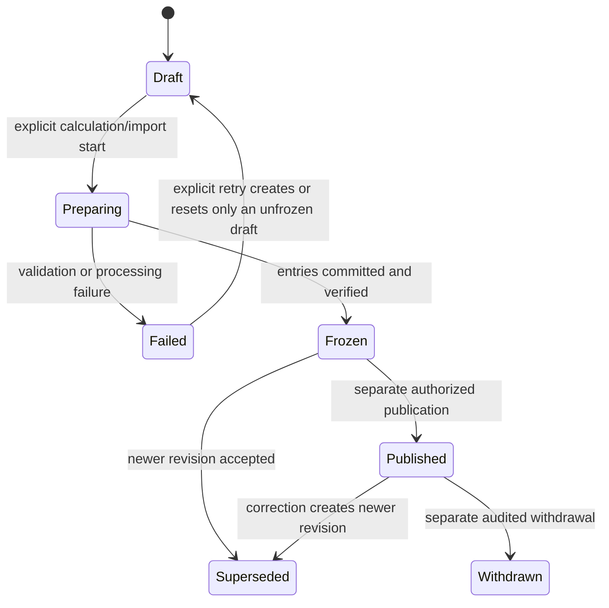

# Ranking Engine Boundaries

## Назначение

Этот документ фиксирует границу между базой данных рейтингов и будущим расчётным компонентом. Database v1 хранит versioned configuration, historical snapshots, ranking entries и links на исходные `CompetitionResult`, но не реализует официальную формулу.

## Что существует в v1

- `RankingDefinition` — категория рейтинга и тип субъекта;
- `RankingRuleSet` — versioned configuration/provenance container;
- `RankingPeriod` — именованный период;
- `RankingSnapshot` — неизменяемая revision состояния периода;
- `RankingEntry` — позиция спортсмена, лошади или пары;
- `RankingEntryResult` — counted/dropped evidence link на результат;
- явные calculation/publication lifecycle fields;
- audit и demo-data boundary.

Эти таблицы позволяют безопасно импортировать или вручную подготовить draft snapshot. Они не являются доказательством официальности расчёта.

## Что v1 не делает

V1 запрещено:

- вычислять официальный рейтинг без утверждённого versioned rule set;
- придумывать коэффициенты, очки, eligibility, tie-breaking или dropped-result правила;
- интерпретировать `CompetitionResult.points`, `penalties`, `rank`, `statusId`, `bonus` или metrics как ranking contribution по умолчанию;
- генерировать FEI ID, national ID, passport number или microchip;
- публиковать snapshot при его создании/импорте;
- изменять entries уже frozen/published snapshot;
- удалять исходные результаты, чтобы изменить исторический рейтинг;
- исполнять JavaScript, SQL или шаблоны из JSON configuration;
- смешивать demo и non-demo graph;
- маркировать demo snapshot как официальный.

## Source-of-truth boundaries

| Concern                       | Source of truth                                 | Не является source of truth                  |
| ----------------------------- | ----------------------------------------------- | -------------------------------------------- |
| Факт результата               | `CompetitionResult` и его source provenance     | `RankingEntryResult.pointsContribution`      |
| Спортивный статус результата  | source-backed `ResultStatus`                    | ranking configuration                        |
| Параметры рейтинга            | утверждённая immutable version `RankingRuleSet` | application constants/frontend               |
| Состояние рейтинга во времени | frozen `RankingSnapshot` revision               | текущие строки Athlete/Horse                 |
| Позиция субъекта              | `RankingEntry` конкретного snapshot             | вычисленный на чтении mutable cache          |
| Counted/dropped evidence      | `RankingEntryResult`                            | удаление проигнорированных source rows       |
| Previous rank                 | entry плюс явный `comparisonSnapshotId`         | неявно «предыдущая дата»                     |
| Публичность                   | `publicationStatus` и `publishedAt`             | `calculationStatus` или sports result status |

Snapshot сохраняет исторический вывод. Изменения display name спортсмена/лошади не должны менять subject identity: связь остаётся по внутреннему UUID. Требования к историческому отображению прежнего имени остаются отдельным вопросом API/audit и не решаются копированием персональных данных в ranking JSON.

## Configuration contract

`RankingRuleSet.configuration` допустим только как JSONB-контейнер для versioned параметров, которые невозможно зафиксировать до получения официального документа. Для каждой непустой конфигурации обязательны:

- `configurationSchemaVersion`;
- централизованная Zod validation schema;
- source document/reference, если конфигурация претендует на официальную;
- immutable version после первой ссылки snapshot;
- audit создания, approval и retirement;
- контроль размера и запрещённых данных.

Configuration не содержит:

- executable code, SQL или template expressions;
- secrets, tokens, database URLs;
- персональные данные спортсменов/владельцев;
- копии результатов или ranking entries;
- официальные коэффициенты, если их источник не утверждён;
- frontend layout/presentation settings.

Новая конфигурация создаёт новую `RankingRuleSet.version`. Existing version не редактируется после использования; correction выполняется следующей version и новой snapshot revision.

## Future calculation contract

Будущий engine может быть подключён только после получения и архитектурного утверждения правил. Он должен:

1. принимать `RankingDefinition`, `RankingPeriod`, одну immutable `RankingRuleSet` version и явно выбранный набор source result UUID;
2. проверять, что definition, rule set, period, subjects и results принадлежат одному demo/non-demo boundary;
3. проверять source/result publication/approval только по утверждённой policy, а не по догадке;
4. использовать decimal arithmetic с утверждёнными precision и rounding; binary floating point для очков запрещён;
5. быть deterministic: одинаковые inputs, rule/config version и engine version дают одинаковый output;
6. не модифицировать `CompetitionResult` и справочники;
7. создавать новую snapshot revision, entries и source links транзакционно или через безопасный staging/finalize workflow;
8. сохранять counted и dropped sources, а не только итоговые очки;
9. проверять duplicate subjects и uniqueness source link;
10. фиксировать calculation method, engine version, timestamps и audit context;
11. завершать snapshot только после consistency checks;
12. не публиковать результат автоматически.

Если official rule document недостаточно точен, engine development останавливается на вопросах, а не дополняет правило собственными коэффициентами.

## Snapshot state machine boundary

Точные коды состояния остаются provisional, но их обязанности разделены:

Это conceptual state machine, а не утверждённый официальный workflow. Lead Architect может выбрать technical enum/string vocabulary, сохранив следующие инварианты:

- calculation state и publication state — разные поля;
- создание, завершение и публикация — разные transitions;
- public visibility требует explicit publish и `publishedAt`;
- demo snapshot остаётся `DRAFT`;
- correction/recalculation не возвращает published snapshot в mutable draft;
- failure сохраняет diagnostic metadata без секретов и не оставляет частично видимый snapshot.

## Recalculation and history

Перерасчёт выполняется так:

1. выбрать predecessor и сохранить его в `supersedesSnapshotId`;
2. получить следующий свободный `revision` внутри period под lock/transaction;
3. выбрать rule set version и comparison snapshot явно;
4. создать новый draft snapshot;
5. сформировать новый immutable entry graph;
6. сравнить totals/counts и provenance;
7. freeze новую revision;
8. отдельно решить publication/promotion;
9. сохранить predecessor без изменения или удаления.

Не допускаются `UPDATE` rank/points/source links у frozen snapshot для «быстрого исправления». AuditLog не заменяет сохранение старого состояния, поэтому history обеспечивается самими revisions.

## Subject integrity

`RankingEntry` использует `subjectType` и два явных FK:

- athlete: только `athleteId`;
- horse: только `horseId`;
- pair: оба FK.

SQL `CHECK` обеспечивает shape; partial unique indexes предотвращают повтор одного субъекта в snapshot. Дополнительно calculation/import service проверяет:

- тип entry совпадает с `RankingDefinition.subjectType`;
- linked result содержит того же athlete/horse;
- archived subject не добавляется без явной import/correction policy;
- все стороны demo или все non-demo.

Definition discipline и period не используются для автоматического отбора результатов, пока official eligibility не утверждена.

## Points and dropped-results boundary

`RankingEntry.points` и `RankingEntryResult.pointsContribution` nullable. Их precision, знак, rounding и взаимосвязь provisional.

До утверждения правил нельзя предполагать, что:

- сумма contributions равна entry points;
- higher/lower points всегда лучше;
- rank уникален;
- status-only result всегда dropped;
- result outside period dates всегда excluded;
- определённое число лучших результатов всегда counted;
- `isCounted=false` означает дисквалификацию.

`isCounted=false` хранит только решение конкретной rule/import version. Причина может быть сохранена в `decisionReason`, но значение не должно выдаваться как официальное без source.

Для frozen snapshot stored `countedResultCount` и `droppedResultCount` должны совпадать с child links. Если imported official snapshot не предоставляет breakdown, counts/links policy требует отдельного решения; система не должна создавать фиктивные links.

## Publication boundary

Публикация выполняется отдельным application service command и одной транзакцией:

- проверить frozen/complete state;
- проверить non-demo policy;
- проверить required provenance и authorization;
- установить publication status и `publishedAt`;
- записать AuditLog;
- не изменять entries.

Публикация demo snapshot запрещена в v1. `calculationMethod=DEMO` всегда означает неофициальный тест. Метод `DEMO` нельзя переименовать в официальный или использовать для production publication.

Withdrawal/archiving не удаляет snapshot. Правила выбора текущего public snapshot и поведение API при withdrawal остаются provisional.

## Idempotency, concurrency and transactions

- unique `(rankingPeriodId, revision)` предотвращает две одинаковые revisions;
- создание revision сериализуется транзакцией/advisory lock либо повторяется после unique conflict;
- unique subject partial indexes предотвращают duplicate entries;
- unique `(rankingEntryId, competitionResultId)` предотвращает double-count link;
- finalize проверяет counts и все references до freeze;
- повторный request с тем же idempotency context должен вернуть существующий draft/result, а не создавать опубликованный duplicate; конкретный idempotency-key storage решается на API этапе;
- crash до finalize не делает snapshot public;
- никаких external network calls внутри долгой DB transaction.

## Audit and observability

Audit фиксирует business-critical transitions, но не подробный технический log каждого арифметического шага. Structured logs содержат internal snapshot UUID, revision, duration, counts и request/job ID, но исключают:

- credentials и connection strings;
- raw documents и лишние PII;
- полную rule configuration, если она может содержать ограниченные данные;
- огромные arrays source results.

Для воспроизводимости сохраняются rule set ID/version, engine version, calculation method, source links, comparison snapshot и timestamps. Хеш входного набора/configuration рекомендуется рассмотреть после утверждения canonical serialization.

## Tests required before a real engine

1. Subject-shape checks для athlete, horse и pair.
2. Partial uniqueness одного субъекта в snapshot.
3. Snapshot revision uniqueness и concurrent creation.
4. Rule set immutability после использования.
5. Restrictive deletion для source results и subjects.
6. Counted/dropped counts consistency.
7. Source result соответствует subject entry.
8. Comparison snapshot соответствует definition/subject type.
9. Demo/non-demo graph isolation.
10. Draft не виден public query.
11. Publish создаёт audit и не меняет entry graph.
12. Recalculation создаёт новую revision и сохраняет predecessor.
13. Одинаковые approved inputs/config/engine дают deterministic output.
14. Failure не публикует частичный snapshot.
15. Повторный demo seed не создаёт duplicate snapshot/entries/links.

## Inputs required before official calculation

До разработки официального engine нужны подтверждённые ответы:

- официальные definitions, disciplines и subject types;
- periods, cutoffs и timezone;
- eligibility спортсменов, лошадей, пар, турниров, классов и результатов;
- status handling;
- formula, coefficients, caps, rounding и precision;
- counted/dropped selection и tie-breaking;
- corrections, withdrawals и late results;
- source authority и verification process;
- approval/publication roles;
- правила public visibility;
- version transition/backfill policy.

Пока эти данные отсутствуют, допустимы только storage, import-to-draft и явно помеченные demo snapshots.
